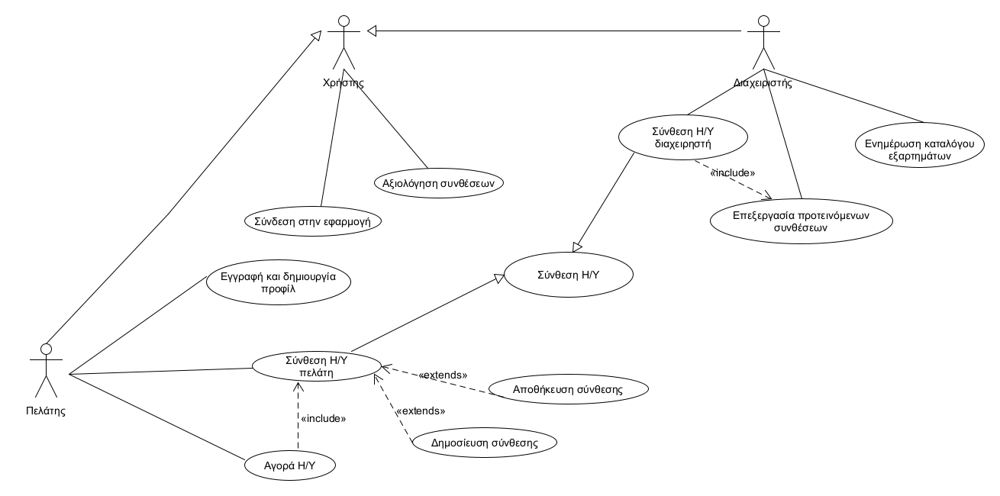

# Εφαρμογή Σύνθεσης και Αγοράς Η/Υ

Σκοπός του λογισμικού είναι η εξυπηρέτηση πελατών για αγορά Η/Υ παρέχοντας την δυνατότητα σύνθεσης ενός συστήματος μέσω μιας πλήρους γκάμας εξαρτημάτων (CPU, Motherboard, GPU).

## Περιγραφή απαιτήσεων λογισμικού

Χρήστες της εφαρμογής θα είναι η ομάδα διαχείρησης και οι πελάτες που ενδιαφέρονται για την δημιουργία συστημάτων Η/Υ και αγορά.

Κάθε σύνθεση Η/Υ θα προκύπτει από συνδυασμό εξαρτημάτων διαφόρων τύπων. Ορισμένοι τύποι εξαρτημάτων θα πρέπει να ενσωματώνονται υποχρεωτικά σε μια νέα σύνθεση (π.χ. μνήμη RAM, επεξεργαστής), ενώ άλλοι είναι προαιρετικοί.

Κάθε εξάρτημα που διατίθεται από το κατάστημα θα συνοδεύεται από πληροφορία όπως ονομασία, κόστος, περιγραφή καθώς και στοιχεία για τις θύρες διασύνδεσής του. Συγκεκριμένα κάθε εξάρτημα θα συνοδεύεται από (α) τύπους προσφερόμενων θυρών διασύνδεσης και πλήθος για κάθε τύπο (π.χ. 1 θύρα τύπου VGA και 2 HDMI για μια κάρτα γραφικών) και (β) τύπους απαιτούμενων θυρών διασύνδεσης για τη λειτουργία του και πλήθος για κάθε τύπο (π.χ. μια κάρτα γραφικών απαιτεί θύρα PCI Express για τη διασύνδεσή της).

- ### Κατά την λειτουργία της εφαρμογής, το σύστημα:

  - Ταυτοποιεί τον χρήστη όταν επιχειρείται σύνδεση, διαχειρηστή και πελάτη.
  - Παρουσιάζει στο περιβάλλον της εφαρμογής τα εξαρτήματα με την περιγραφή τους και προσφέρει δυνατότηες σύγκρισης.
  - Ελέγχει την συμβατότητα μεταξύ των διάφορων κομματιών του Η/Υ κατά την σύνθεση και την επιλογή των υποχρεωτικών τύπων.

- ### Ο πελάτης:

  - Κάνει εγγραφή και δημιουργεί το προσωπικό του προφίλ με τα στοιχεία του. Η εγγραφή αποτελεί προϋπόθεση για την χρήση της εφαρμογής.
  - Επιχειρεί σύνδεση στην εφαρμογή με τα στοιχεία του.
  - Συναρμολογεί υπολογιστές από την αρχή και χρησιμοποιεί εργαλεία σύγκρισης και φίλτρα αναζήτησης εξαρτημάτων.
  - Προσθέτει στο καλάθι και μπορεί να προβεί στην αγορά του Η/Υ που τον ενδιαφέρει από το κατάστημα.
  - Αποθηκεύει συνθέσεις Η/Υ για μεταγενέστερο χρόνο, με την επιπλέον δυνατότητα δημοσίευσης έτσι ώστε να μπορούν εύκολα άλλοι χρήστες να προβούν στην ίδια αγορά.
  - Μπορεί να αξιολογεί τις δημοσιευμένες συνθέσεις άλλων χρηστών(like). Τα στοιχεία αξιολογήσεων θα εμφανίζονται στα αποτελέσματα αναζήτησης συνθέσεων και εξαρτημάτων.

- ### Η ομάδα διαχείρησης της εφαρμογής:
  - Ενημερώνουν κατάλληλα τον κατάλογο των εξαρτημάτων και των στοιχείων συμβατότητας.
  - Μπορούν και αυτοί να αξιολογούν τις δημοσιευμένες συνθέσεις των χρηστών.
  - Οι διαχειρηστές επίσης εκτελούν σύνδεση στο σύστημα με τα στοιχεία τους.
  - Αποδέχονται τις έγκυρες παραγγελίες Η/Υ όταν είναι έτοιμες για αποστολή.

## Περιπτώσεις Χρήσης Λογισμικού:

_[Ζητούμενο R2.1]_

Ο χρήστης (πελάτης και διαχειρηστής):

- [Συνδέεται στην εφαρμογή](/docs/Software_requirements/uc_login.md)
- [Αξιολογεί συνθέσεις άλλων χρηστών](/docs/Software_requirements/uc_vote.md)

Ο πελάτης εκτελέι:

- [Εγγραφή στην εφαρμογή](/docs/Software_requirements/uc_signup.md)
- [Σύνθεση υπολογιστή](/docs/Software_requirements/uc_customer_build.md)
- [Αποθήκευση](/docs/Software_requirements/uc_save_build.md) και [δημοσίευση](/docs/Software_requirements/uc_publish_build.md) σύνθεσης που έχει δημιουργήσει
- [Αγορά υπολογιστή](/docs/Software_requirements/uc_order.md)

Ο διαχειριστής μπορέι και:

- [Ενημερώνει τους καταλόγους των εξαρτημάτων Η/Υ](/docs/Software_requirements/uc_parts_update.md)
- [Επεξεργάζεται την λίστα των έτοιμων προτεινόμενων συνθέσεων](/docs/Software_requirements/uc_ready_build_update.md) και να
- [Δημιουργεί συνθέσεις](/docs/Software_requirements/uc_admin_build.md)

Η ΠΧ [Σύνθεση Η/Υ](/docs/Software_requirements/uc_build.md) αποτελέι γενίκευση των εξατομικευμένων περιπτώσεν "Σύνθεση Η/Υ πελάτη" και "Σύνθεση Η/Υ διαχειριστή"

## Διάγραμμα Περιπτώσεων Χρήσης

## Μη Λειτουργικές Απαιτήσεις

_[Ζητούμενο R2.2]_

Οι μη λειουργικές απαιτήσεις του λογισμικού είναι [εδώ](/docs/Software_requirements/non_functional_requirements.md)

## Μοντέλο Πεδίου

_[Ζητούμενο R2.3]_

## Σχεδίαση Λογικής του Πεδίου
_Περιγραφή πάνω στην σχεδίαση της λογικής του πεδίου θα βρείτε [εδώ](docs/design/design.md)_

## Σχεδίαση του Συστήματος
_Περιγραφή πάνω στην σχεδίαση του συστήματος θα βρείτε [εδώ](docs/System/system.md)_