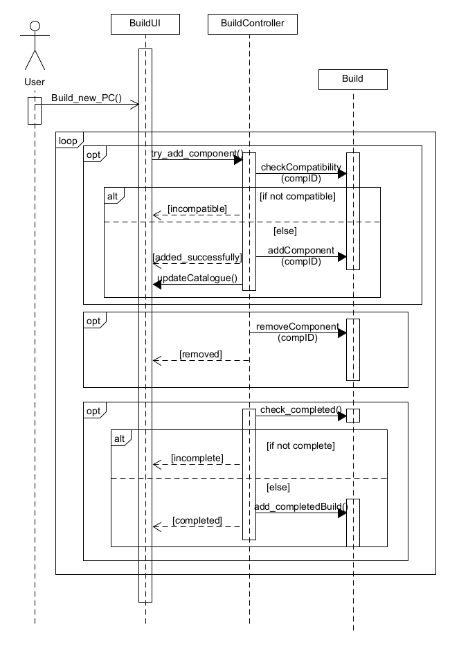

# Σύνθεση Η/Υ

Η "Σύνθεση Η/Υ" αποτελεί γενικευμένη ΠΧ και δεν έχει άμεσα ενδιαφερόμενους, οπότε ούτε πρωτεύων Actor.

## Βασική Ροή

## Α) Σύνθεση Η/Υ

1. Ο χρήστης επιλέγει να δημιουργήσει έναν υπολογιστή από την αρχή.
2. Επιλέγει μία από τις κατηγορίες των εξαρτημάτων για να διαλέξει κομμάτι.
3. Το σύστημα εμφανίζει τις διαθέσιμες επιλογές για την επιλεγμένη κατηγορία, δηλαδή μόνο τα εξαρτήματα που είναι συμβατά με την μέχρι στιγμής σύνθεση (Έλεγχος συμβατότητας).
4. Ο χρήστης αναζητά και επιλέγει κάποιο εξάρτημα και συνεχίζει επιλέγοντας άλλη κατηγορία (βήμα 2).
5. Ο χρήστης έχει πρόσβαση στην τρέχουσα κατάσταση της σύνθεσης και μπορεί να αφαιρέσει κάποιο εξάρτημα, ώστε να τοποθετήσει νέο.
6. Το σύστημα ελέγχει πότε η Σύνθεση περιέχει τα απαραίτητα εξαρτήματα ώστε να μπορεί να δημιουργηθεί ένας Υπολογιστής.
7. Ο χρήστης επιλέγει "Oλοκλήρωση" της σύνθεσης.

### Εναλλακτικές Ροές

5α. Δεν έχουν επιλεγεί εξαρτήματα από όλους τους απαιτούμενους τύπους.

- Η επιλογή "Ολοκλήρωση" δεν είναι διαθέσιμη και ο χρήστης συνεχίζει την επιλογή εξαρτημάτων.

### Διάγραμμα Ακολουθίας

