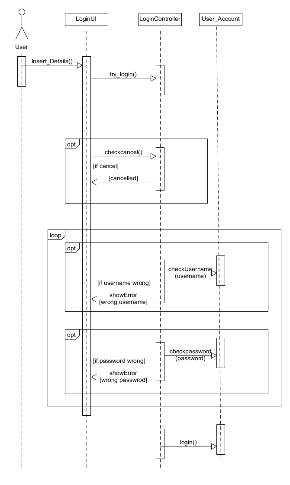

# Σύνδεση στην εφαρμογή

**Πρωτεύων Actor:**
Χρήστης

**Ενδιαφερόμενοι:**
Ο χρήστης θέλει να συνδεθεί στην εφαρμογή για να έχει πρόσβαση στις υπηρεσίες της.

## Βασική Ροή

### Σύνδεση

1. Ο χρήστης επιλέγει "Σύνδεση".
2. Το σύστημα ζητάει από το χρήστη να συμπληρώσει τα στοιχεία(username,password) που δημιούργησε κατά την εγγραφή.
3. Ο χρήστης συμπληρώνει τα στοιχεία του και επιλέγει "Είσοδος".
4. Το σύστημα ελέγχει και επιβεβαιώνει την ορθότητα του username και password του χρήστη.
5. Το σύστημα πραγματοποιεί τη σύνδεση του πελάτη,εμφανίζει μήνυμα "Επιτυχής Σύνδεση" και τον μεταφέρει στην αρχική σελίδα της εφαρμογής.

## Εναλλακτικές Ροές

3α. _Ο πελάτης επιλέγει ακύρωση σύνδεσης._

- Η περίπτωση χρήσης τερματίζει.

4α. _Το username που εισήγαγε ο χρήστης δεν αντιστοίχει σε υπάρχοντα λογαριασμό._

- Το σύστημα εμφανίζει μήνυμα λάθους και πάει στο βήμα 2.

4β. _Ο κωδικός που εισήγαγε ο χρήστης είναι λανθασμένος._

- Το σύστημα εμφανίζει μήνυμα λάθους και πάει στο βήμα 2.

### Διάγραμμα Ακολουθίας

