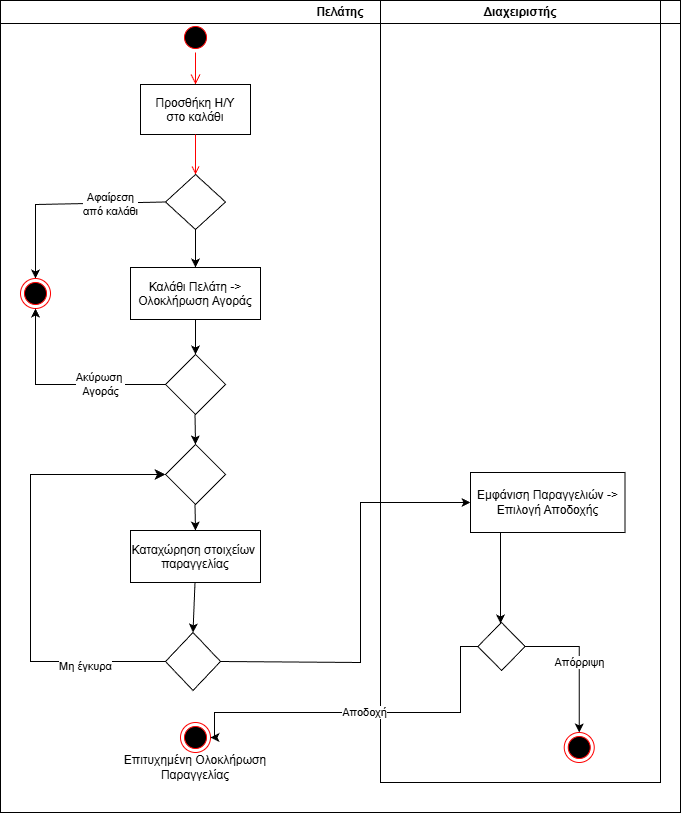
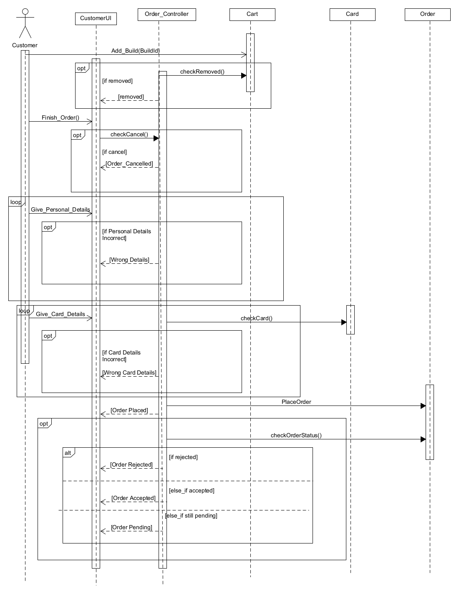

# ΠΧ Αγορά Η/Υ

**Πρωτεύων Actor:** Πελάτης\
**Ενδιαφερόμενοι:**\
**Πελάτης:** Επιθυμεί να αγοράσει έναν Η/Υ, τον οποίο είτε τον συνέθεσε ο ίδιος, είτε τον πήρε από τους ίδη έτοιμους.\
**Διαχειριστής:** Θέλει να αποδεχτεί εκ μέρους του καταστήματος την παρραγγελία του πελάτη.\

**Προϋποθέσεις:** Ο πελάτης να έχει πραγματοποιήσει σύνθεση Η/Υ (εάν τον συνέθεσε εκείνος) ή να κατευθύνθηκε επιτυχώς στο κατάλογο των έτοιμων συνθέσεων και να επέλεξε μία από αυτές.

## Βασική Ροή

## Αγορά Η/Υ

1. Ο πελάτης προσθέτει το προϊόν στο καλάθι του. Προκειμένου αυτή να προστεθεί με επιτυχία, θα έχει γίνει νωρίτερα έλεγχος ότι όλα τα εξαρτήματα είναι συμβατά μεταξύ τους (έλεγχος κομμάτι-κομμάτι κατά τη προσθήκη τους στη σύνθεση, αν τη φτιάχνει ο πελάτης μόνος του).
2. Στη συνέχεια, ο πελάτης μεταβαίνει στο καλάθι του και πατάει να ολοκληρωθεί η αγορά.
3. Το σύστημα ζητάει να συμπληρώσει βασικά στοιχεία (ονοματεπώνυμο, διεύθυνση αποστολής, πόλη, περιοχή, ταχυδρομικός κώδικας) και εφόσον είναι όλα σωστά, συμπληρώνει τα στοιχεία της κάρτας του (χρεωστικής/πιστωτικής) για να καταχωρηθεί η παραγγελία του στο σύστημα.
4. Το σύστημα καταχωρεί την παραγγελία. Η παραγγελία είναι σε κατάσταση "Pending" μέχρι αποδοχής ή μη από την ομάδα διαχείρισης.
5. Ο διαχειριστής βλέπει στο περιβάλλον της εφαρμογής τις αγορές/παραγγελίες των πελατών. Για κάποια παραγγελία επιλέγει αποδοχή (το κατάστημα μπορεί να εξυπηρετήσει την συγκεκριμένη παραγγελία).
6. Το σύστημα αλλάζει την κατάσταση της παραγγελίας από "Pending" σε "Approved". Η αλλαγή αυτή φαίνεται και στον διαχειρηστή και στον πελάτη.

### Εναλλακτικές Ροές

1α. _Εφόσον ο πελάτης προσθέσει το προϊόν στο καλάθι του, για κάποιο λόγο το αφαιρεί._

- Η ΠΧ τερμάτιζει έστω προσωρινά, μέχρι ο πελάτης να προσθέσει κάτι στο καλάθι του το οποίο να μπορεί να αγοράσει

2α. _Ο πελάτης αντί να πατήσει να ολοκληρωθεί η αγορά, επιλέγει να την ακυρώσει._

- Η σύνθεση παραμένει στο καλάθι αγοράς του πελάτη σε περίπτωση που επιθυμεί μεν να την αγοράσει, αλλά ακύρωσε την ολοκλήρωση της αγοράς για να προσθέσει και άλλα πράγματα στο καλάθι του/ καταλάθος.

3α. _Κάποια από τα βασικά στοιχεία του πελάτη ( διεύθυνση κλπ.) δεν είναι έγκυρα._

- Εμφανίζεται κατάλληλο μήνυμα και ζητείται από τον πελάτη να συμπληρώσει τα στοιχεία του ορθά.

3β. _Τα στοιχεία της κάρτας που προσθέτει για την αγορά ο πελάτης δεν είναι σωστά._

- Εμφανίζεται κατάλληλο μήνυμα σφάλματος και ζητείται από τον πελάτη να επανασυμπληρώσει τα στοιχεία της κάρτας του

5α. _Αν η παραγγελία δεν μπορεί να εξυπηρετηθεί, η παραγγελία απορρίπτεται._

- Ενημερώνεται ο πελάτης, η παραγγελία διαγράφεται και τερματίζει η ΠΧ.

### Διάγραμμα Δραστηριότητας

### Διάγραμμα Ακολουθίας

