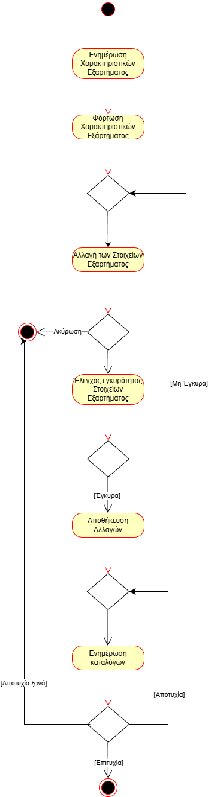

# ΠΧ Ενημέρωση Καταλόγου Εξαρτημάτων

**Πρωτέυων Actor:** Διαχειριστής\
**Ενδιαφερόμενοι:**\
**Διαχειριστής:** Θέλει να ενημερώσει την λίστα των προϊόντων που προσφέρονται και τις ιδιότητές τους (συμβατότητα, περοιρισμοί)

## Βασική Ροή

## Α) Προσθήκη Εξαρτήματος

1. Ο διαχειριστής επιλέγει να προσθέσει νέο εξάρτημα και την κατηγορία (CPU, Motherboard, RAM κλπ).
2. Το σύστημα ζητάει να συμπληρωθούν το όνομα και τα αντίστοιχα χαρακτηριστικά του εξαρτήματος.
3. Ο διαχειριστής εισάγει τα στοιχεία και πατάει επιβεβαίωση. Το σύστημα ελέγχει την εγκυρότητα των στιοχείων.
4. Το σύστημα αποθηκεύει το νέο εξάρτημα και ενημερώνει τους καταλόγους.

### Εναλλακτικές Ροές

3α. Ο διαχειριστής επιλέγει ακύρωση

- Η ΠΧ τερματίζει χωρίς κάποια αλλαγή στους καταλόγους

3β. Τα στοιχεία δεν είναι έγκυρα

- Το σύστημα ζητάει ξανά την εισαγωγή

4α. Η ενημέρωση των καταλόγων αποτυγχάνει

- Το σύστημα προσπαθεί ξανά την ενημέρωση, άμα δεν τα καταφέρει η ΠΧ τερματίζει χωρίς αλλαγές.

## Β) Ενημέρωση Χαρακτηριστικών Εξαρτήματος

1. Ο διαχειριστής επιλέγει ενημέρωση εξαρτήματος, την κατηγορία και το εξάρτημα που επιθημεί να επεξεργαστεί.
2. Το σύστημα φορτώνει τα χαρακτηριστικά του εξαρτήματος και τα δυνατά για αλλαγή στοιχεία.
3. Ο διαχειριστής εφαρμόζει τις αλλαγές και επιλέγει αποθήκευση. Το σύστημα ελέγχει την εγκυρότητα των στοιχείων.
4. Το σύστημα αποθηκεύει τις αλλαγές και ενημερώνει τους καταλόγους.

### Εναλλακτικές Ροές

3α. Ο διαχειριστής επιλέγει ακύρωση

- Η ΠΧ τερματίζει χωρίς κάποια αλλαγή στους καταλόγους.

3β. Τα στοιχεία δεν είναι έγκυρα

- Το σύστημα ζητάει ξανά την εισαγωγή.

4α. Η ενημέρωση των καταλόγων αποτυγχάνει

- Το σύστημα προσπαθεί ξανά την ενημέρωση, άμα δεν τα καταφέρει η ΠΧ τερματίζει χωρίς αλλαγές.

### Διάγραμμα Δραστηριότητας

## Γ) Διαγραφή Εξαρτήματος

1. Ο διαχειριστής επιλέγει διαγραφή εξαρτήματος, την κατηγορία και το εξάρτημα που θέλει να διαγράψει. Επιλέγει επιβεβαίωση διαγραφής.
2. Το σύστημα διαγράφει το εξάρτημα από τους καταλόγους.
3. Το σύστημα ενημερώνει την κατάσταση των παραγγελιών που περιέχουν ήδη αυτό το εξάρτημα.

### Εναλλακτικές Ροές

1α. _Ο διαχειριστής επιλέγει ακύωση_

- Η ΠΧ τερματίζει χωρίς διαγραφή εξαρτήματος.

2α. _Η ενημέρωση των καταλόγων αποτυγχάνει_

- Το σύστημα προσπαθεί ξανά την ενημέρωση, άμα δεν τα καταφέρει η ΠΧ τερματίζει χωρίς αλλαγές.
