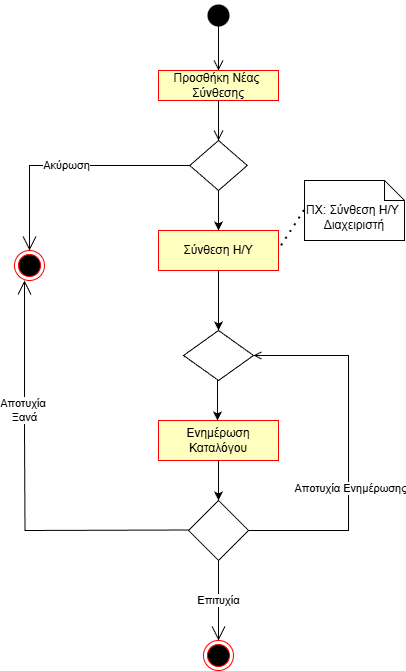

# Επεξεργασία Προτεινόμενων Συνθέσεων

**Πρωτέυων Actor:** Διαχειριστής\
**Ενδιαφερόμενοι:**\
**Διαχειρηστής:** Επιθυμεί να ενημερώσει την λίστα των προτεινόμενων συνθέσεων Η/Υ

## Βασική Ροή

## Α) Προσθήκη Νέου Η/Υ

1. Ο διαχειρηστής επιλέγει την προσθήκη νέας σύνθεσης Η/Υ στην λίστα.
2. Ο διαχειρηστής εκτελέι [Σύνθεση Η/Υ διαχειριστή](uc_admin_build.md).
3. Το σύστημα προσθέτει το Build στην λίστα των προτεινόμενων συνθέσεων.

### Εναλλακτικές Ροές

1α. _Ο διαχειριστής επιλέγει ακύρωση_

- Η ΠΧ τερματίζει

3α. _Η ενημέρωση του καταλόγου των προτεινόμενων συνθέσεων αποτυγχάνει_

- Το σύστημα προσπαθεί ξανά, αν δεν τα καταφέρει η ΠΧ τερματίζει χωρίς αλλαγές.

### Διάγραμμα Δραστηριότητας

## Β) Επεξεργασία Υπάρχουσας Σύνθεσης

1. Ο διαχειριστής επιλέγει επεξεργασία σύνθεσης και τον υπολογιστή που θέλει να τροποποιήσει.
2. Το σύστημα ανακατευθύνει τον διαχειριστή στο περιβάλλον Σύνθεσης Η/Υ με τα ήδη επιλεγμένα εξαρτήματα τοποθετημένα.
3. Αφού ο διαχειριστής οριστικοποιήσει το Build, το Σύστημα ενημερώνει τον κατάλογο.

### Εναλλακτικές Ροές

1α. _Ο διαχειριστής επιλέγει ακύρωση_

- Η ΠΧ τερματίζει.

3α. _Η ενημέρωση των καταλόγων αποτυγχάνει_

- Το σύστημα προσπαθεί ξανά την ενημέρωση, άμα δεν τα καταφέρει η ΠΧ τερματίζει χωρίς αλλαγές.

## Γ) Αλλαγή Τιμής Η/Υ

1. Ο διαχειριστής επιλέγει αλλαγή τιμής και τον Υπολογιστή που επιθυμεί. Το σύστημα ζητάει να εισάγει την νέα τιμή.
2. Το σύστημα αποθηκεύει την νέα τιμή και ενημερώνει τους καταλόγους.

### Εναλλακτικές Ροές

1α. _Ο διαχειριστής επιλέγει ακύρωση_

- Η ΠΧ τερματίζει.

1β. _Ο διαχειριστής εισάγει μη έγκυρη τιμή_

- Το σύστημα ζητάει ξανά την εισαγωγή.

2α. _Η ενημέρωση των καταλόγων αποτυγχάνει_

- Το σύστημα προσπαθεί ξανά την ενημέρωση, άμα δεν τα καταφέρει η ΠΧ τερματίζει χωρίς αλλαγές.

## Δ) Διαγραφή Η/Υ

1. Ο διαχειριστής επιλέγει διαγραφή Η/Υ από την λίστα. Επιλέγει τον Υπολογιστή που επιθυμεί να διαγράψει και επιβεβαίωση διαγραφής.
2. Το σύστημα διαγράφει το Build από τον κατάλογο.

### Εναλλακτικές Ροές

1α. _Ο διαχειριστής επιλέγει ακύρωση_

- Η ΠΧ τερματίζει.

2α. _Η ενημέρωση των καταλόγων αποτυγχάνει_

- Το σύστημα προσπαθεί ξανά την ενημέρωση, άμα δεν τα καταφέρει η ΠΧ τερματίζει χωρίς αλλαγές.
