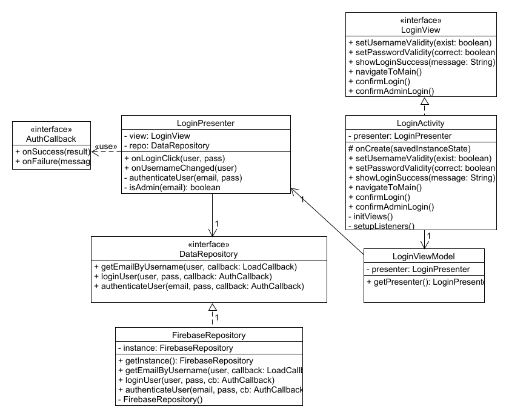
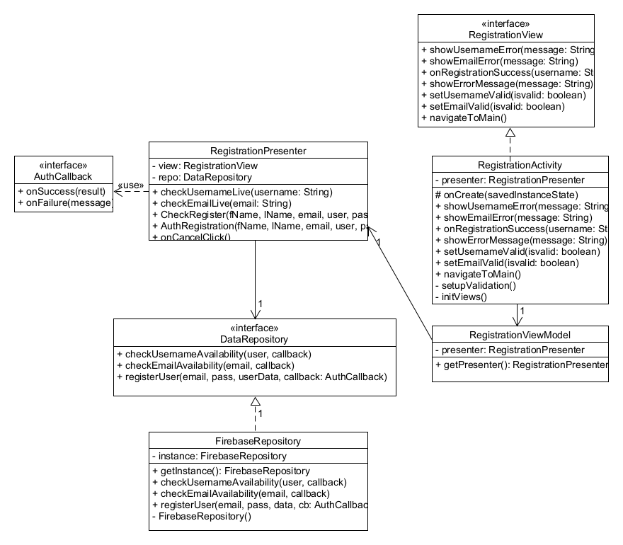
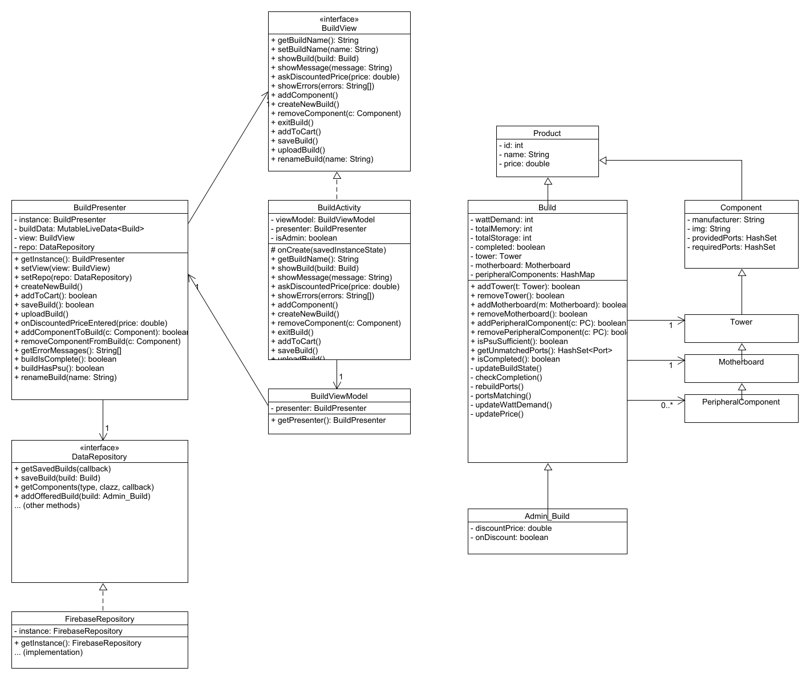
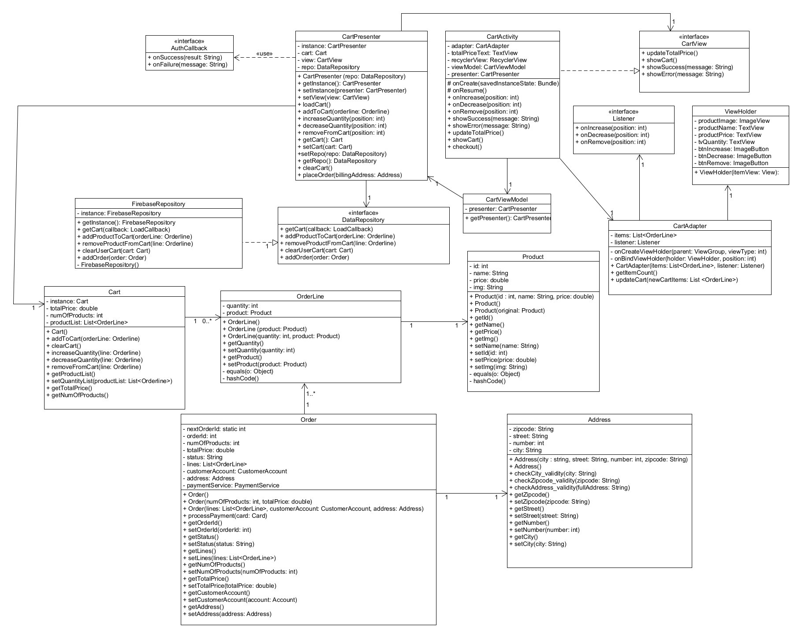
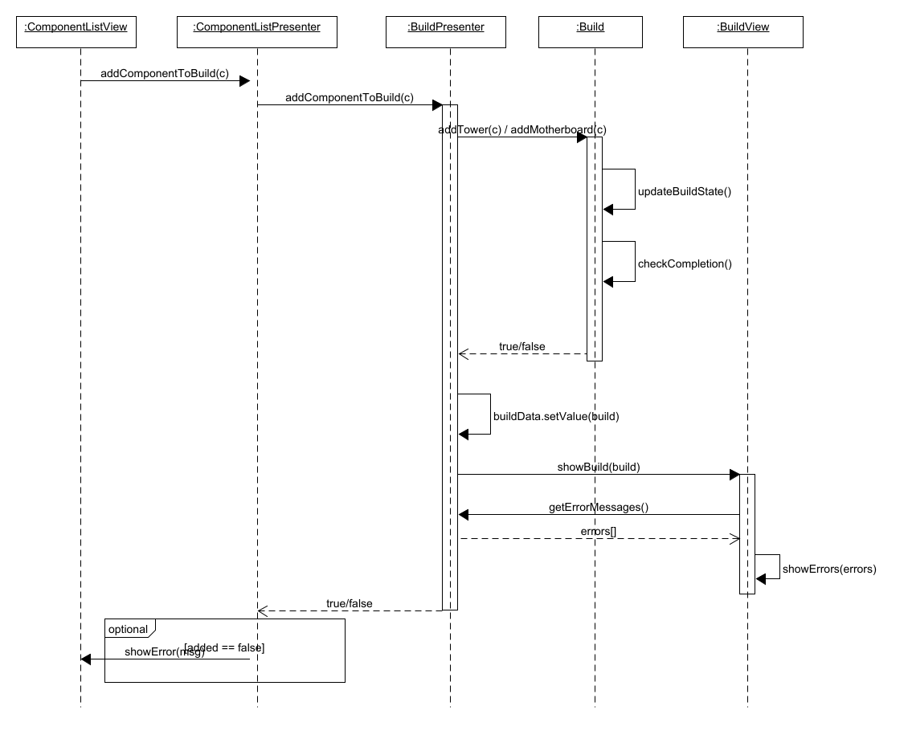
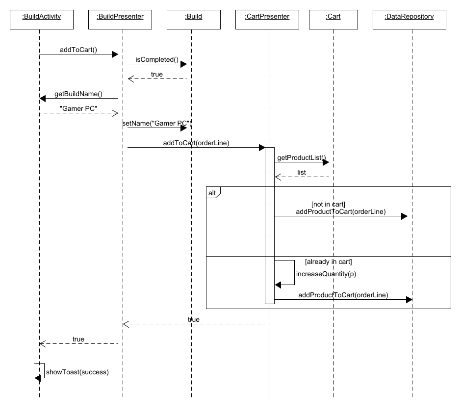

# Σχεδίαση και Υλοποίηση του Συστήματος

## Διαγράμματα Κλάσεων πάνω στην σχεδίαση του λογισμικού

### Δραστηριότητα Login - Είσοδος στην Εφαρμογή με στοιχεία χρήστη

### Δραστηριότητα Register - Εγγραφή στην Εφαρμογή με στοιχεία χρήστη

### Δραστηριότα Build - Κατασκεή Η/Υ

### Δραστηριότα CartView - Όψη του καλαθιού

### Διάγραμμα Ακολουθίας για προσθήκη εξαρτήματος στην σύνθεση - Μέθοδος addComponentToBuild(component)

### Διάγραμμα Ακολουθίας για προσθήκη της σύνθεσης στο καλάθι - Μέθοδος addToCart()

# JUnit Testing και Code Coverage
Για τουε ελέγχους του προγράμματος πραγματοποιήθηκαν JUnit τεστς στους presenters του κάθε Activity, επιβεβαιώνοντας της ορθή λειτουργικότητα και επικοινωνία μεταξύ των presenters. Η κάλυψη γραμμών κώδικα αγγίζει το 100%, ενώ έχουμε 100% κάλυψη στις μεθόδους των presenters με ελάχιστες εξερέσεις.

