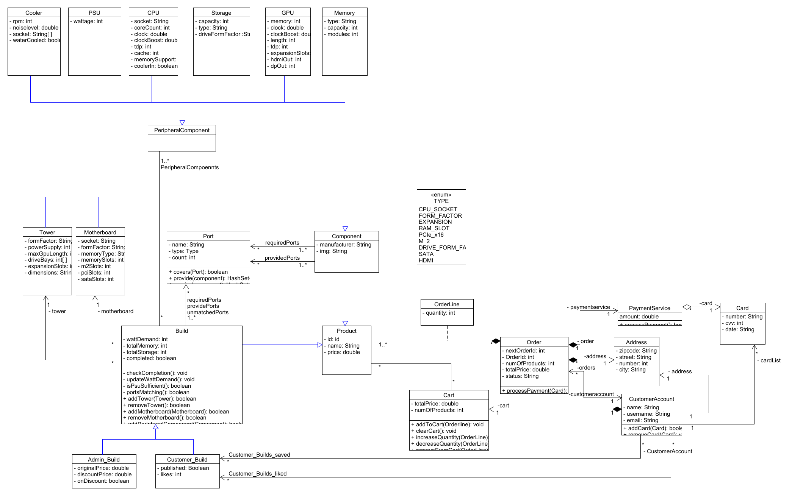
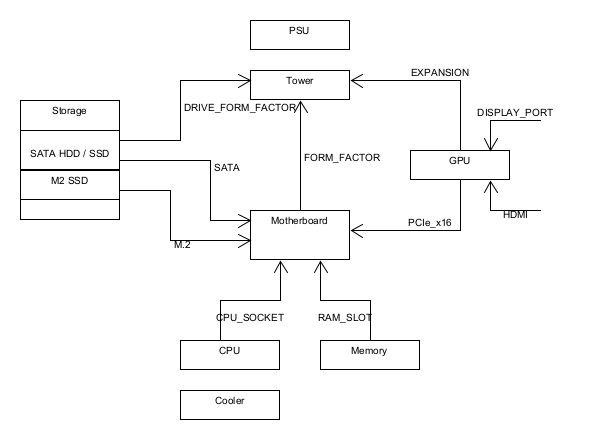
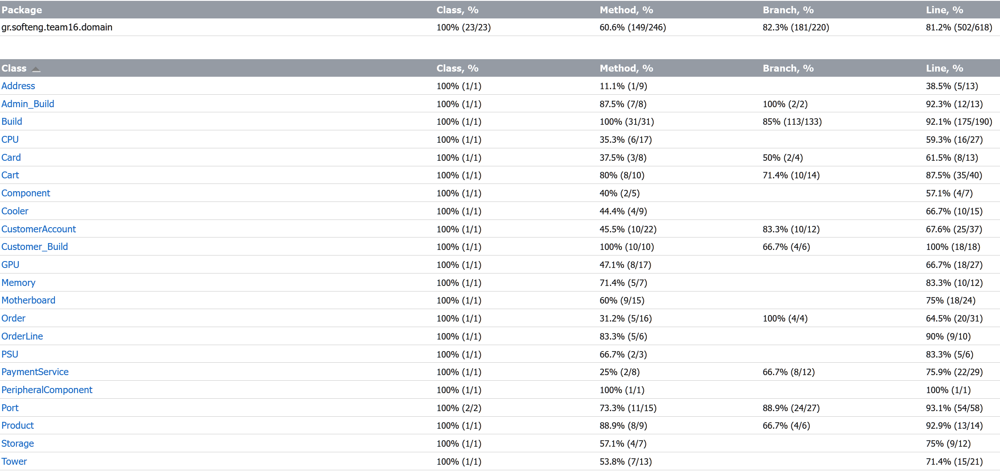

# Σχεδίαση της Λογικής του πεδίου

## Διάγραμμα Κλάσεων

Το διάγραμμα κλάσεων αποτυπώνει το περιεχόμενο (κέλυφος) της κάθε κλάσεις, την ιεραρχία των κλάσεων και πως αυτές αλληλεπιδρούν.

Για την σύνδεση των διάφορων Components μεταξύ τους χρησιμοποιούνται Ports ώστε να ελέγχεται η συμβατότητα. Το παρακάτω σχήμα αποτυπώνει την σχέση μεταξύ των Components και τα Ports που τα συνδέουν.

## Έλεγχος Λογικής του Πεδίου

Πραγματοποιήθηκαν αυτόματοι έλεγχοι με JUnit4. Οι έλεγχοι καλύπτουν το 100% των κλάσεων με ποσοστό κάλυψης γραμμών κώδικα 81%. Μεγάλο κομμάτι των μεθόδων έιναι set(), get() και λόγω των πολλών υποκλάσεων με πολλά πεδία (π.χ. Motherboard, CPU) δεν έγινε πλήρης ελέγχος σε όλες αυτές, αλλά δειγματολειπτικά σε ορισμένες ιδιότητες. Οι λειτουργίες αυτές είναι αρκετά απλές ώστε να μην απαιτείται πλήρης κάλυψη για την διασφάλιση της ορθής λειτουργικότητας του λογισμικού. Έτσι, έχουμε κάλυψη των μεθόδων στο 60%.

